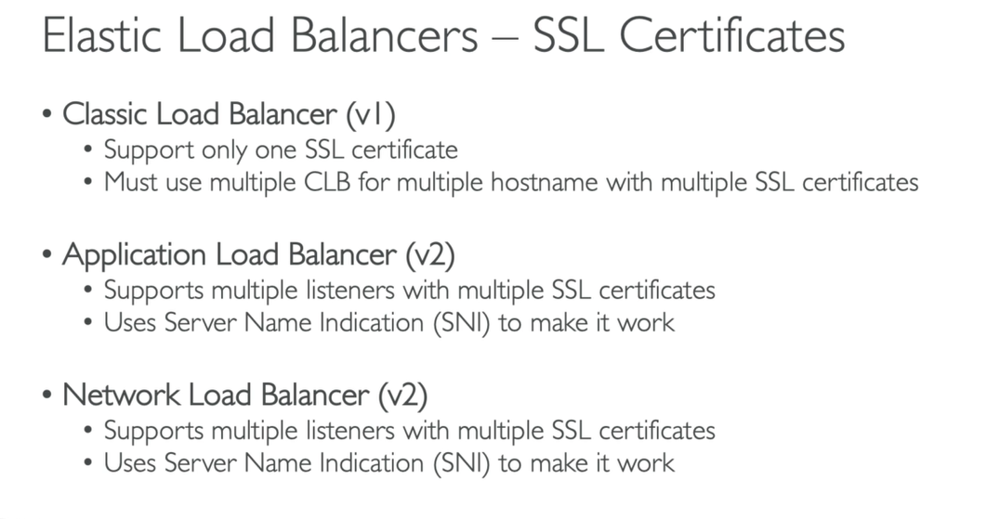

## SSL and TLS
- 
- 
- 
- 
- 
- 

### for alb, we can use a different certificate for each rule.
- 

### for NLB, we provide the details as below.you can observer the protocol TCP and port 443
- 

## ELB - connection draining:
- 
